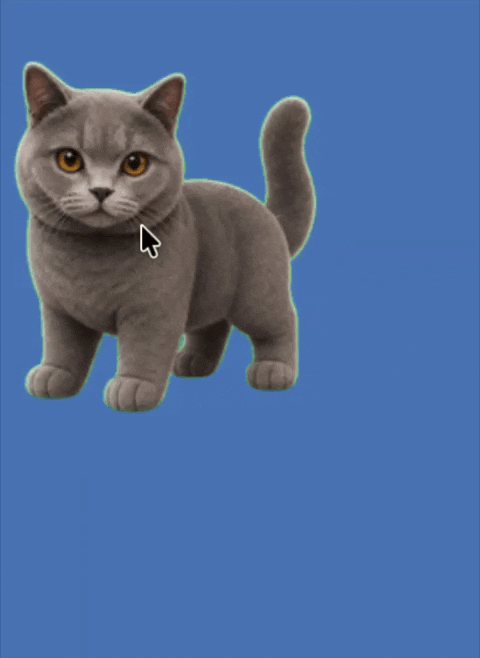

# Desktop Pet

[English](README.md) | [中文](README.zh-CN.md)

`desktop_pet` is a Flutter macOS desktop pet proof of concept. It renders a Codex atlas pet animation in a transparent, borderless, always-on-top desktop window, supports dragging, a right-click menu, local pet resource discovery, and persists the selected pet, scale, always-on-top preference, and window position.

## Example



## Status

Current release: `v0.1.1`

Release state: macOS internal alpha. Core paths pass automated verification and the app is runnable. The right-click menu runs in an auxiliary window, uses the real cursor screen position, and shows compact status/error feedback.

## Features

- Transparent 200x200 macOS pet window with hidden title bar and window buttons.
- Always-on-top window visible across macOS Spaces.
- Bundled default Codex pet atlas at `assets/pets/default_pet/`.
- Local pet discovery from `${CODEX_HOME:-$HOME/.codex}/pets/<pet-id>/`.
- Strict normalized `pet.json` manifest parsing.
- Atlas-based `idle` animation with manifest-defined frame timing.
- Drag-to-move window behavior with persisted position.
- Auxiliary-window right-click menu for status, pet switching, size controls, always-on-top, resource refresh, config reset, recovery, and quit.
- Config persistence through `SettingsStore`.
- Runtime behavior managed through `PetController` and `PetState`.

## Known Limitations

- Local resource validation reports exist in the repository layer, but invalid resource reasons are not yet surfaced in UI.
- The app is ad-hoc signed, not Developer ID signed or notarized. First launch requires right-click Open.
- macOS is the only validated platform for this release.

## Requirements

- Flutter SDK compatible with Dart `^3.11.5`
- macOS for the validated desktop target

## Run

```sh
flutter pub get
flutter run -d macos
```

## Build And Package

Debug build:

```sh
flutter build macos --debug
open "build/macos/Build/Products/Debug/Desktop Pet.app"
```

Release build:

```sh
flutter build macos --release
open "build/macos/Build/Products/Release/Desktop Pet.app"
```

Build a DMG:

```sh
bash scripts/package_dmg.sh
```

Output: `dist/Desktop Pet-<version>.dmg`

## Install From DMG

1. Double-click the DMG to mount it.
2. Drag `Desktop Pet` into `Applications`.
3. For the first launch, right-click the app in Applications and select **Open**.
4. When the Gatekeeper dialog appears, click **Open**.
5. Later launches work with a normal double-click.

## Verify

```sh
dart format lib test
flutter analyze
flutter test
flutter build macos --debug
flutter build macos --release
bash scripts/package_dmg.sh
```

Manual smoke checklist for the macOS alpha:

- Launch, drag the pet, quit, and relaunch to confirm position persistence.
- Open the right-click menu near each screen edge and confirm it stays visible.
- Click away from the menu and confirm the auxiliary window closes.
- Switch between bundled and local resources, then refresh resources.
- Repeat the menu open and edge-position checks on each connected display.

## Pet Resource Format

Bundled resource:

```text
assets/pets/default_pet/
├── pet.json
└── spritesheet.webp
```

Local resource:

```text
${CODEX_HOME:-$HOME/.codex}/pets/<pet-id>/
├── pet.json
└── spritesheet.webp
```

Manifest shape:

```json
{
  "id": "default_pet",
  "name": "Default Pet",
  "description": "Default desktop pet.",
  "defaultScale": 1.0,
  "atlas": {
    "image": "spritesheet.webp",
    "columns": 8,
    "rows": 9,
    "frameWidth": 192,
    "frameHeight": 208
  },
  "animations": {
    "idle": {
      "row": 0,
      "frames": [0, 1, 2, 3, 4, 5],
      "durationsMs": [280, 110, 110, 140, 140, 320],
      "loop": true
    }
  }
}
```

Invalid manifests, unsafe relative paths, missing spritesheets, missing atlas data, and resources without an `idle` animation are ignored by runtime resource loading. The repository also exposes structured ignored-resource reports for future validation UI. Invalid bundled resources should fail initialization.

## Architecture

```text
lib/
├── app/
│   ├── app.dart
│   └── pet_menu_window_app.dart
├── desktop/
│   ├── auxiliary_window_arguments.dart
│   ├── auxiliary_window_bootstrap.dart
│   ├── auxiliary_window_controller.dart
│   ├── desktop_auxiliary_window_controller.dart
│   ├── desktop_window_controller.dart
│   ├── macos_window_bootstrap.dart
│   ├── platform_capabilities.dart
│   ├── window_bootstrap.dart
│   └── windows_window_bootstrap.dart
├── pet/
│   ├── animation/
│   ├── controller/pet_controller.dart
│   ├── model/
│   └── view/
├── resources/
│   ├── data/pet_resource_repository.dart
│   └── model/
└── settings/settings_store.dart
```

Main window runtime flow:

```text
main.dart
  -> SettingsStore
  -> WindowBootstrap (MacosWindowBootstrap | WindowsWindowBootstrap)
  -> DesktopWindowController
  -> DesktopAuxiliaryWindowController
  -> App
       -> PetResourceRepository
       -> PetController
       -> PetView
            -> PetHitArea
            -> PetActor
```

Auxiliary menu window runtime flow:

```text
main.dart
  -> AuxiliaryWindowArguments
  -> AuxiliaryWindowBootstrap
  -> PetMenuWindowApp
       -> PetContextMenu
```

## Windows Validation Checklist

Windows is scaffolded but not a supported release target yet. Before changing that status, validate on a Windows host:

- `flutter build windows --release`
- `scripts/package_windows.bat`
- Launch from the release build and packaged zip.
- Transparent borderless window rendering.
- Always-on-top behavior.
- Drag-to-move and persisted position.
- Right-click menu open, actions, and blur-close.
- Local resource discovery from `%USERPROFILE%/.codex/pets` and `CODEX_HOME/pets`.
- Multi-display placement.
- Screen-edge pet/menu positioning.

## Roadmap Summary

See `EVOLUTION_PLAN.md` for the full plan. Near-term priorities:

1. Add local resource validation reporting so users can understand ignored resources.
2. Keep `PetActor` render-only before expanding animation behavior.
3. Add app icon, Developer ID signing, and notarization before end-user distribution.
4. Validate the Windows scaffold after the macOS alpha baseline stays green.
